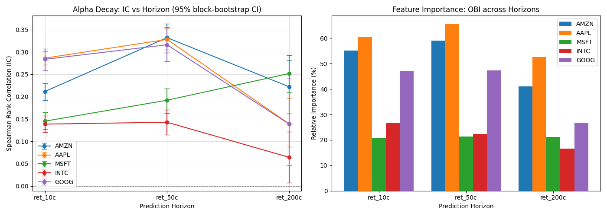

# Alpha Decay Predictor — KDB+/q × Python HFT Research Pipeline

> How fast does a high-frequency trading signal die? This project measures the
> decay of order-book alpha on real NASDAQ limit-order-book data, with feature
> engineering running natively in **KDB+/q** and modeling in **Python (LightGBM)**
> over a **PyKX IPC** bridge.

## What it does

Using full-depth LOBSTER limit-order-book data (NASDAQ: AMZN, AAPL, GOOG, MSFT,
INTC), the pipeline:

1. **Ingests millions of order-book events in KDB+/q** and computes
   microstructure features fully vectorized: micro-price, bid-ask spread,
   rolling volatility, and order-book imbalance (OBI) at 1, 5, and 10 price
   levels of depth.
2. **Streams the engineered data to Python** over a PyKX IPC connection.
3. **Trains one LightGBM model per prediction horizon** (10, 50, 200 ticks
   ahead) to forecast forward returns.
4. **Measures the Information Coefficient (IC)** — rank correlation between
   predictions and realized returns — at each horizon, producing the alpha
   decay curve above.

## Headline results

| Symbol | IC @ 10 ticks | IC @ 50 ticks | IC @ 200 ticks |
| ------ | :-----------: | :-----------: | :------------: |
| AMZN   |     0.21      |   **0.33**    |      0.22      |
| AAPL   |     0.29      |   **0.33**    |      0.14      |
| GOOG   |     0.28      |   **0.32**    |      0.14      |
| MSFT   |     0.15      |     0.19      |    **0.25**    |
| INTC   |     0.14      |     0.14      |      0.06      |

- **Order-book imbalance is genuinely predictive but fast-dying**: IC peaks
  around 50 ticks ahead and fades sharply by 200 — exactly why HFT firms must
  act on this signal class within fractions of a second.
- **Market structure matters**: high-priced, wide-tick names (AAPL, AMZN, GOOG)
  lean heavily on OBI (47–66% of model gain) with fast decay, while cheap,
  tick-constrained names (MSFT, INTC) show flatter, weaker signal.

## Methodological rigor

- **Purged walk-forward validation** — chronological 70/30 split with an
  embargo gap equal to the longest forward-return horizon, so no training
  label overlaps the test period (no look-ahead leakage).
- **Moving-block bootstrap confidence intervals** — overlapping forward
  returns make tick observations heavily serially dependent, so naive
  p-values are wildly optimistic; all reported ICs carry 95% CIs from block
  resampling that preserves the serial dependence structure.
- **Honest caveats** — single trading day, no transaction costs, latency, or
  fill modeling: this measures signal decay, not strategy viability.

## Tech stack

`kdb+/q` · `PyKX (IPC)` · `Python` · `LightGBM` · `NumPy / pandas / SciPy` ·
`pytest` (fully tested Python layer, runnable without a q license)

## Source code availability

The source code of this project is **private** and is made available
**exclusively in the context of recruitment processes** (recruiters, hiring
managers, and interviewers are welcome).

To request access, contact me at **elia.zontaa@gmail.com**.
